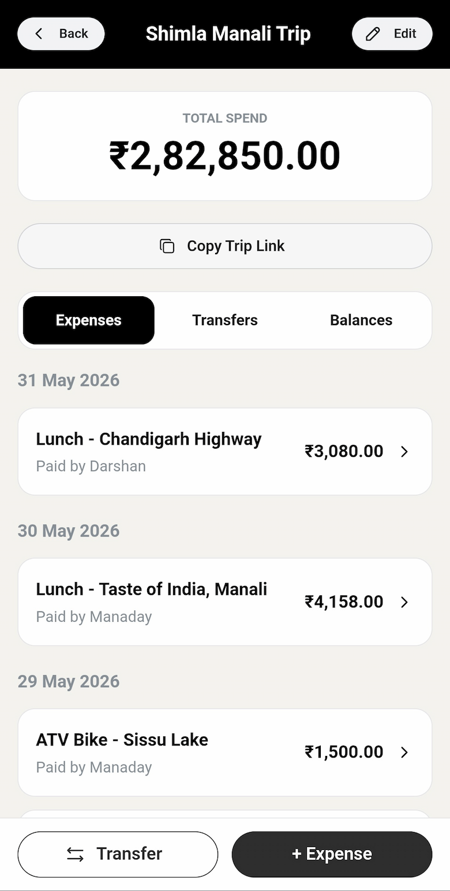
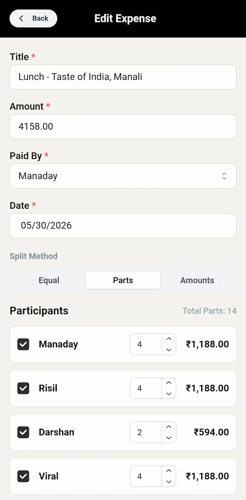
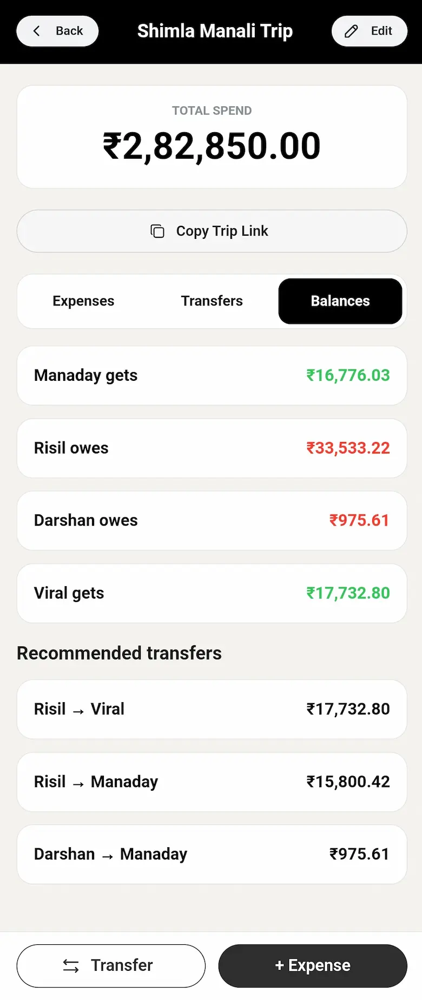

# Split Pilot

**Create a trip. Share a private link. Settle exactly.**

[Open Split Pilot →](https://splitpilot.app)

Split Pilot is a free, account-free shared trip expense tracker. Create a trip, share its private link, record expenses and repayments, and see exactly who owes what.

Built for friends, families, couples, and travel groups who want to track shared costs without spreadsheets, sign-ups, or app installs.

## See it in action

### Trip overview

One shared place for the whole trip — expenses, transfers, balances, and your private link.

### Expense splits

Split equally, by parts, or by exact amounts. Split Pilot handles the math for hotels, dinners, cabs, and everything in between.

### Balances and settlements

See who owes what, get recommended transfers, and record repayments — including quick **Record payment →** links from suggested settlements.

## Why groups use it

Shared trips get messy fast. Someone pays for fuel, someone else covers dinner, repayments happen along the way, and by the end nobody is sure who still owes whom.

Split Pilot keeps everything in one trip:

- No account or login required
- Private trip link for financial participants
- One participant can represent a family, couple, or paying group
- Expenses and repayments in one timeline
- Splits by equal share, parts, or exact amounts
- Automatic balances and settlement recommendations
- Multiple currencies supported at trip level
- Trip pages excluded from search indexing for privacy

## Participants

In Split Pilot, a **participant** is someone who pays — not necessarily every trip member.

Each participant can represent one or more members in the group. For example, one participant might stand in for an entire family, a couple, or a roommate pair. You only need to add the people who will actually pay or settle up, not every person on the trip.

Share the private trip link with those financial participants — the people who need to record expenses, review balances, and settle.

## How it works

1. [Create a trip](https://splitpilot.app).
2. Add the people who will pay — each participant can represent one or more members.
3. Share the private trip link with those financial participants.
4. Record expenses and choose how each one should be split.
5. Record repayments as money changes hands.
6. Review balances and follow the recommended settlement transfers.

More detail: [How it works](docs/how-it-works.md) · [FAQ](docs/frequently-asked-questions.md)

## Good for

- Friend trips
- Family holidays
- Couples travelling together
- Multi-family trips
- Roommates or temporary shared expenses

## Privacy

No account is required. Trips open through private links, and trip pages are excluded from search indexing.

Anyone with the link may be able to access the trip — share it only with financial participants who need to manage or settle expenses, not necessarily every trip member. [Privacy model →](docs/privacy-model.md)

## Documentation

|                                           |                             |
| ----------------------------------------- | --------------------------- |
| [How it works](docs/how-it-works.md)      | Step-by-step user journey   |
| [FAQ](docs/frequently-asked-questions.md) | Common questions            |
| [Privacy model](docs/privacy-model.md)    | How private links work      |
| [Changelog](CHANGELOG.md)                 | Release history             |
| [Roadmap](ROADMAP.md)                     | Directional product outlook |
| [Security](SECURITY.md)                   | Report a security concern   |
| [Copyright](COPYRIGHT.md)                 | Usage and rights            |

## About

**Split Pilot** is built by [LEAN Technolabs](https://leantechnolabs.com).

This repository contains public product documentation and approved screenshots. The production application’s source code is maintained in a separate private repository and is not distributed through this project.

---

Copyright © 2026 LEAN Technolabs. All rights reserved.